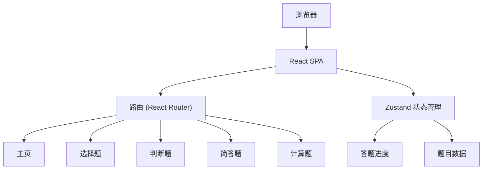

## 1. 架构设计
纯前端单页应用，数据全部内嵌于前端代码中，无需后端服务。



## 2. 技术说明
- 前端：React@18 + TypeScript + Tailwind CSS@3 + Vite
- 初始化工具：vite-init
- 后端：无
- 数据库：无，所有题目数据内嵌

## 3. 路由定义
| 路由 | 用途 |
|------|------|
| / | 主页，题型导航与进度统计 |
| /choice | 选择题答题页 |
| /judge | 判断题答题页 |
| /short | 简答题答题页 |
| /calc | 计算题答题页 |

## 4. API定义
无后端API，所有数据前端内嵌。

## 5. 数据模型
### 5.1 选择题数据结构
```typescript
interface ChoiceQuestion {
  id: number;
  question: string;
  options: string[];
  answer: number; // 正确选项索引
  analysis: string;
}
```

### 5.2 判断题数据结构
```typescript
interface JudgeQuestion {
  id: number;
  question: string;
  answer: boolean;
  analysis: string;
}
```

### 5.3 简答题数据结构
```typescript
interface ShortQuestion {
  id: number;
  question: string;
  answer: string;
}
```

### 5.4 计算题数据结构
```typescript
interface CalcQuestion {
  id: number;
  question: string;
  answer: string; // 含解题步骤
}
```
